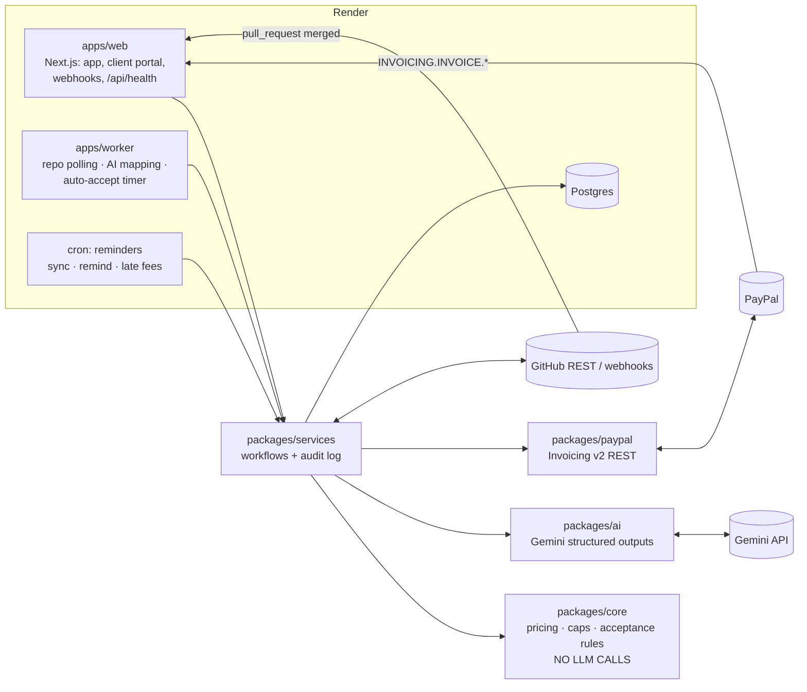

# ProofBill — invoices that prove the work

**Milestone-verified invoicing for freelancers.** The contract says what's owed, the evidence proves it's done, PayPal collects — with the proof attached.

Freelancers chase payments; clients dispute what was delivered. ProofBill closes the gap between *"I did the work"* and *"here's your money"*:

1. **Contract → terms.** Upload a SOW / contract / email thread (PDF, DOCX, text). Gemini extracts milestones, acceptance criteria, fees, due dates, dependencies, hourly rate and cap, total cap, Net-N, partial-payment minimum, late fee and acceptance window — **every field cites the clause it came from**. You review, edit, confirm.
2. **Evidence → milestones.** Merged GitHub PRs (any public repo via polling, or webhooks), Figma/doc links and uploaded files are mapped to milestones by AI with a **confidence score and rationale**. You confirm each mapping; low-confidence items wait for manual mapping.
3. **Client acceptance portal.** Mark a milestone complete and your client gets a private evidence portal: every acceptance criterion with the evidence behind it. They **accept** or **request changes with reasons**. Silence past the contract's window (sample SOW: 5 business days) = accepted.
4. **Acceptance → PayPal invoice.** The amount is **computed in code from the contract** (fixed fee, or logged hours × rate), capped. AI writes the client-readable line descriptions citing evidence. You approve → ProofBill creates and sends the invoice with **PayPal Invoicing v2**, partial payments enabled per the contract.
5. **Collect.** PayPal webhooks track partial and full payment. A cron sends overdue reminders through PayPal's `remind` with an AI-written, tone-matched note, and issues late-fee invoices per the contract.

> **ProofBill never holds your money.** Clients pay you directly through PayPal; we just make sure the invoice proves the work.

Unlike bounty tools (e.g. MergePay), ProofBill handles **client contracts** — invoicing against agreed milestones, client acceptance, partial payments, reminders — and evidence is pluggable, not code-only.

---

## Try it

**Hosted demo:** _add the Render URL here after deploy_ → **Try the demo workspace** (no sign-up; seeded Larkspur contract).

**Locally (≈2 minutes, no credentials needed):**

```bash
corepack enable
pnpm install
cp .env.example .env           # leave PayPal/Gemini blank to run fully offline
createdb proofbill             # or point DATABASE_URL at any Postgres 14+
set -a; . ./.env; set +a
pnpm db:migrate
pnpm --filter web build && pnpm --filter web start   # http://localhost:3000
pnpm --filter worker start                            # second terminal: evidence mapping + auto-accept
```

Click **Try the demo workspace**. Without credentials, ProofBill runs in offline mode: a PayPal Invoicing simulator (same idempotency, duplicate and partial-payment rules, with its own payer page) and labelled heuristic extraction/mapping instead of Gemini. Add keys to use the real services:

| To enable | Set |
|---|---|
| PayPal sandbox | Tick **Invoicing** and **Transaction search** on the REST app. `PAYPAL_CLIENT_ID`, `PAYPAL_CLIENT_SECRET`, `PAYPAL_ENV=sandbox`, `PAYER_EMAIL` (sandbox **Personal** account — demo invoices go there), `PAYPAL_WEBHOOK_ID` (webhook → `https://<host>/api/webhooks/paypal`, events `INVOICING.INVOICE.*`) |
| Gemini | `GEMINI_API_KEY` (optional `GEMINI_MODEL`, default `gemini-flash-latest`) |
| GitHub login | `GITHUB_OAUTH_CLIENT_ID/SECRET` (callback `https://<host>/api/auth/github/callback`) |
| GitHub webhooks | `GITHUB_WEBHOOK_SECRET` (payload URL `https://<host>/api/webhooks/github`, event *Pull requests*) |
| Higher GitHub rate limit | `GITHUB_TOKEN` (read-only) |

### PayPal sandbox tips

- Use a sandbox **Business** account (the freelancer) and a **Personal** account (the client), both in the **same country**, ideally US.
- Feature toggles on the REST app (Invoicing, Transaction search) can take **about 10 minutes** to apply. Remember to click *Save*.
- A webhook belongs to one app in one environment. For local testing, expose port 3000 with a tunnel (e.g. `ngrok http 3000` or `cloudflared tunnel --url http://localhost:3000`) and register `https://<tunnel>/api/webhooks/paypal`. Recreate the webhook for live.
- When something misbehaves, check Developer Dashboard → **Event logs** (API calls, errors, webhook deliveries with *Resend*) and **Sandbox notifications** (the emails PayPal would have sent).

### Judge walkthrough (sandbox)

1. **Try the demo workspace** → *Invoice Export Platform* (Larkspur Labs, from [`sample-sow.md`](sample-sow.md)).
2. **Evidence inbox:** PR #18 is proposed for Milestone 2 with confidence + rationale → *Confirm*.
3. **Milestone 1** is already accepted by the client → *Build invoice* → review the code-computed $600 and AI-written lines → **Approve & send with PayPal**.
4. Open the **payer link** in a private window, log in as the sandbox Personal account, pay **$150** (partial; minimum is 25%). The webhook flips the invoice to *Partially paid* in the ledger and on the timeline.
5. *Send reminder now* → AI-written note delivered by PayPal `remind`. *Try to create a duplicate* → PayPal answers `422 DUPLICATE_INVOICE_ID` (enable **Negative Testing** on the sandbox business account).
6. **Bring your own:** *New contract* → upload any SOW; on the contract page paste any public repo — merged PRs become evidence.
7. **Open portal** shows the client side: criteria ✓ with evidence, accept / request changes.

`week0-paypal-check.sh` validates the raw Invoicing v2 loop (token → create → idempotent replay → mocked duplicate → send → partial pay → remind → paid) against your sandbox app.

---

## Architecture



| Path | What |
|---|---|
| `packages/core` | Pure, unit-tested business rules: money in integer cents, invoice pricing (fixed / hourly), hourly cap, contract cap, partial-payment minimum, business-day acceptance windows, milestone state machine + dependencies, late-fee and reminder schedules, invoice numbering. **No LLM calls.** |
| `packages/db` | Drizzle schema + SQL migrations (Postgres). |
| `packages/ai` | Gemini prompts + JSON schemas: term extraction (with source clauses), evidence mapping (confidence + rationale), invoice line writing, reminder notes, the read-only *Ask the ledger* agent. Deterministic fallbacks for offline mode. `pnpm --filter @proofbill/ai eval` runs a live extraction/mapping eval. |
| `packages/paypal` | Invoicing v2 REST client: token cache, `PayPal-Request-Id` on writes, retries with backoff on 429/5xx, negative-testing header, webhook signature verification, invoice-number search for crash recovery. |
| `packages/services` | Workflows shared by web/worker/cron; every state change writes an audit event. Includes the offline PayPal simulator. |
| `apps/web` | Next.js App Router UI, client portal, webhook routes. |
| `apps/worker` | Background loop + `reminders` cron entry. |

## Guardrails

- **AI proposes, a human approves.** Extracted terms, evidence mappings and invoice text are proposals until the freelancer confirms them. Low-confidence mappings (< 0.6) stay unassigned for manual mapping.
- **The LLM never sets a price.** Amounts come from `packages/core` using confirmed terms. AI text that mentions money is discarded and replaced by a template.
- **Contract cap enforced** when the draft is built *and* again at send time; over-cap invoices are blocked (try *Attempt an over-cap invoice*). Hourly caps likewise.
- **Idempotency:** deterministic invoice numbers (`PB-<code>-M<n>`), DB uniqueness (one live invoice per milestone), a claimed `sending` state against double-clicks, `PayPal-Request-Id` per operation, and on `DUPLICATE_INVOICE_ID` the existing PayPal invoice is found by number and adopted instead of creating another. Proven by the negative test and integration tests.
- **Webhooks:** PayPal signatures verified via `POST /v1/notifications/verify-webhook-signature` with `PAYPAL_WEBHOOK_ID`; GitHub via HMAC `X-Hub-Signature-256`. Both deduped by event/delivery id. PayPal state is re-read from the API (source of truth); the cron re-syncs open invoices in case a webhook is missed.
- **Hours are never inferred from commits.** Hourly work comes from user-entered time entries only.
- **Reconciliation:** when a payment arrives, and again on the cron, ProofBill looks up the matching PayPal transactions with **Transaction Search** (matched by PayPal invoice id or invoice number). It records each transaction's gross, PayPal fee and net, shows *net received* in the invoice and the ledger, and flags a mismatch if the transactions don't add up to what Invoicing reports. Search results can lag by up to 3 hours, which counts as *pending* rather than a mismatch.
- **Audit log:** every AI output is stored with its rationale and source (clause, PR) and shown per contract and per invoice, alongside user, client and system actions.

**Late-fee policy:** simple interest at the contract rate on the balance outstanding, once per full 30 days overdue, issued as a separate PayPal invoice (`…-LF<n>`, idempotent per period). Late fees don't count toward the contract cap.

## Party model

The freelancer is the merchant: invoices are issued from the freelancer's own PayPal business account and the client pays the freelancer directly. ProofBill is not a merchant of record, platform or marketplace, and never touches funds.
For the hackathon, one sandbox US Business account is the demo freelancer and a sandbox US Personal account is the client. In production each freelancer would connect their own PayPal account through partner onboarding with third-party invoicing permissions *(exact permission scope pending confirmation with PayPal)*.

## Tools used, and how

| Tool | How ProofBill uses it |
|---|---|
| **PayPal Invoicing v2 (REST)** | Create (`Prefer: return=representation`, `PayPal-Request-Id`), send, get, search, remind, cancel; partial payments with `minimum_amount_due`; `HOURS`/`AMOUNT` units; `INVOICING.INVOICE.*` webhooks with signature verification; Negative Testing (`DUPLICATE_INVOICE_ID`). |
| **Gemini API** (`@google/genai`, `gemini-flash-latest` by default) | JSON-schema-constrained output (validated again with zod) for term extraction with source clauses, evidence mapping with confidence/rationale, invoice line descriptions and tone-matched reminders; a function-calling read-only agent that answers ledger questions with live PayPal invoice reads. |
| **AG Grid** (Enterprise, trial) | Receivables ledger: one row per invoice line, master-detail showing the evidence behind each line, row grouping by client/status, filters and side bar. |
| **Render** | Blueprint (`render.yaml`): web service, background worker, cron job and Postgres; migrations run as a pre-deploy command. |
| **Timeline** | Milestone Gantt (dependencies, due dates, acceptance windows, invoice due markers, progress from confirmed evidence) rendered as SVG — the planned fallback while the Bryntum Gantt license is unconfirmed. |
| **GitHub** | REST polling of merged PRs for any public repo, PR webhooks, OAuth login. |
| **APIMatic Context Plugin** + **PayPal Server SDK** | Payment reconciliation is built on `@paypal/paypal-server-sdk` (APIMatic-generated) with the PayPal Server SDK Context Plugin's TypeScript skills, which are checked in under [`.claude/skills/`](.claude/skills/README.md). The skills' guidance shaped the client setup: an explicit timeout (the SDK default of 0 means no timeout), GET retries enabled through both retry fields, Transaction Search's 31-day windows with manual paging, and tests that use a stub adapter and a seeded OAuth token. They also led to one finding: `SearchError` arrives with `result` unparsed, so we fall back to the raw body. The plugin doesn't cover Invoicing v2, which stays on our REST client. |

## Development

```bash
pnpm typecheck
pnpm test                      # core + paypal + ai unit tests; services integration tests need Postgres:
                               #   TEST_DATABASE_URL=postgres://…/proofbill_test (dropped & re-migrated each run)
pnpm db:generate               # after editing packages/db/src/schema.ts
pnpm db:seed --reset           # re-seed the demo workspace
```

## License

[MIT](LICENSE)
